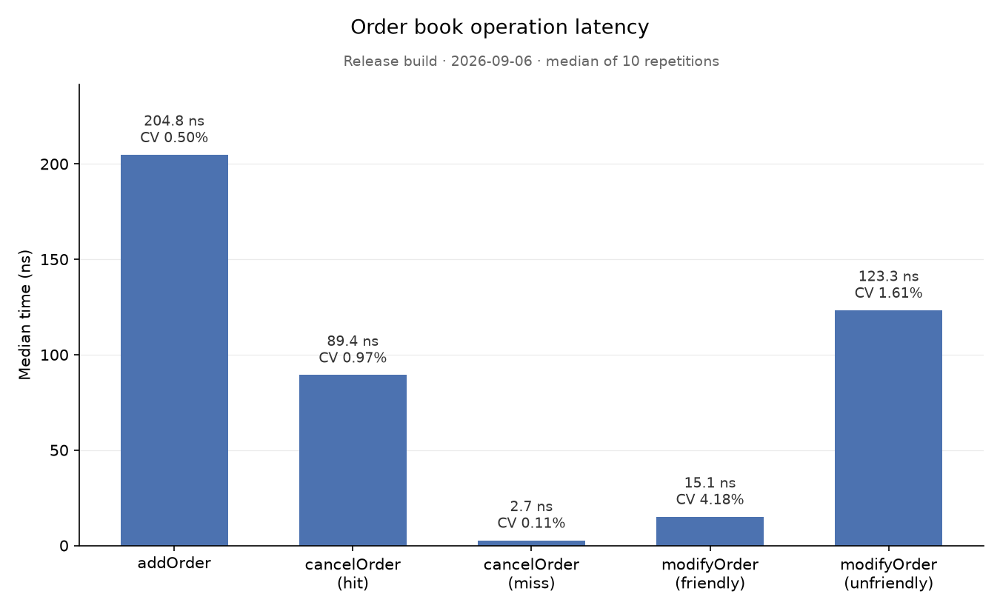

# OrderBook

A price-time priority limit order book and matching engine in C++17, with a
GoogleTest suite (136 tests) and a Google Benchmark suite that measures what
each operation actually costs — and a worked example of using those
measurements to decide what to change.

| Operation | Median latency |
|---|---|
| `addOrder` (crossing two-sided flow, includes matching) | **215.9 ns** |
| `cancelOrder` — order exists | **63.4 ns** |
| `cancelOrder` — order does not exist | **2.8 ns** |
| `modifyOrder` — quantity reduced in place | **12.2 ns** |
| `modifyOrder` — price changed (cancel + re-add) | **117.2 ns** |

Single-threaded, Apple M2 Max, Release build. These are the numbers after
making `cancelOrder` O(1); the [Results](#results) section keeps the baseline
alongside them and explains the difference.



---

## Contents

- [What it does](#what-it-does)
- [Usage](#usage)
- [Design](#design)
- [Building](#building)
- [Benchmarks](#benchmarks)
- [Workload](#workload)
- [Project structure](#project-structure)
- [Future work](#future-work)

---

## What it does

- **Price-time priority matching.** Best price first; at equal price, the
  order that arrived first fills first. Trades execute at the resting order's
  price.
- **Order types:** `GTC` (rests until cancelled), `IOC` (fills what it can,
  discards the rest), `FOK` (fills completely or does nothing), and market
  orders.
- **Operations:** `addOrder`, `addMarketOrder`, `cancelOrder`, `modifyOrder`.
  Cancel and in-place quantity reduction are O(1) — no lookup by price.
- **O(1) depth queries** — `getLevelQuantity`, `getLevelCount` — from
  per-level aggregates maintained incrementally, never by walking a level.
- **136 unit tests** across two suites: 56 on book state (resting, level data,
  cancel, modify, argument validation) and 80 on matching semantics (GTC
  partial/full fills and sweeps, time priority, trade contents, IOC, FOK,
  market orders).
- **Benchmark suite** on Google Benchmark with a deterministic synthetic
  workload; results are committed alongside the script that plots them.

---

## Usage

The library is `orderbook_lib`; include `orderbook.hpp` and you get the whole
API.

```cpp
#include "orderbook.hpp"

OrderBook book;

// Rest a sell at 10 001 for 50.
OrderResult ask = book.addOrder(OrderType::GTC, Side::sell, 10'001, 50);

// A buy at 10 002 for 80 crosses: 50 fill at the resting price (10 001),
// the remaining 30 rest at 10 002.
OrderResult bid = book.addOrder(OrderType::GTC, Side::buy, 10'002, 80);
printTrades(bid.trades);   // [✓] MATCH | BUY #2 vs SELL #1 @ €10001 | 50 units traded

book.getLevelQuantity(Side::buy, 10'002);   // 30
book.getBestBid()->getRemainingQuantity();  // 30

// Reducing quantity at the same price keeps the order's queue position
// and its ID. Any other change is a cancel + re-add and returns a new ID.
book.modifyOrder(bid.orderID, 10'002, 10);

book.cancelOrder(bid.orderID);
```

That example is [`src/main.cpp`](src/main.cpp), built as the `orderbook`
target — run `./build/src/orderbook` to see it execute.

Semantics worth knowing:

- IDs are assigned by the book (`1, 2, 3, …`) and returned in `OrderResult`.
  A `modifyOrder` that changes price or increases quantity loses time priority
  and returns a **new** ID; the old one is gone.
- `addOrder` / `modifyOrder` throw `std::invalid_argument` on zero quantity or
  non-positive price. `modifyOrder` returns `std::nullopt` for an unknown ID.
  `cancelOrder` on an unknown ID is a silent no-op.
- A market order is converted internally to an `IOC` limit order at the worst
  price on the opposite side, so it sweeps everything available and discards
  any residual. Against an empty opposite side it returns an ID and no trades.
- `FOK` is checked against the per-level aggregates before touching the book,
  so a rejected FOK leaves the book untouched. It still consumes an order ID,
  which comes back in `OrderResult` alongside an empty trade list.

---

## Design

### Core data structures

```cpp
std::map<Price, OrderPointers, std::greater<Price>> bids_;   // OrderPointers = std::list<std::shared_ptr<Order>>
std::map<Price, OrderPointers, std::less<Price>>    asks_;
std::unordered_map<OrderID, OrderEntry>              orders_;
std::unordered_map<Price, LevelData>                 bidsData_; // { qty, count } per level
std::unordered_map<Price, LevelData>                 asksData_;

struct OrderEntry {
    OrderPointer            order_;
    OrderPointers::iterator location_;   // this order's node in its level list
    OrderPointers*          level_;      // the level list itself
    LevelData*              levelData_;  // the level's aggregates
};
```

`bids_` and `asks_` are ordered by price with the best price at `begin()`,
which is all matching ever looks at. Each level is a FIFO list, so time
priority is list order. `bidsData_` / `asksData_` keep running quantity and
order count per level, updated on every add, fill, cancel and modify; that is
what makes depth queries and the FOK pre-check O(levels) rather than
O(orders).

`orders_` maps an ID to everything a cancel needs: the order, an iterator to
its list node, and pointers to its level list and level aggregates. Both
`std::map` and `std::unordered_map` guarantee that an element's address is
stable until that element is erased, and a level is only erased once its last
order leaves it, so the two pointers are valid for exactly as long as the
entry exists. The result is that `cancelOrder` never looks anything up by
price — it goes straight from the ID to the node.

### Matching

`match()` loops while the incoming order has remaining quantity and the
opposite side's best level is at or through its limit price. Each iteration
fills against the front of the best level, records a `Trade{bidID, askID,
price, quantity}` at the resting price, and pops the resting order if it is
now filled. Empty levels are erased immediately, so `begin()` is always a
live level.

### Complexity

*L* is the number of distinct price levels — not the number of orders. A book
holding millions of orders may span a few dozen levels, so log *L* stays
small no matter how deep the book gets.

| Operation | Complexity | Notes |
|---|---|---|
| `addOrder` | O(log L) + matching | `std::map` insert; each match iteration is O(1) |
| `cancelOrder` | O(1) | hash lookup, list erase via stored iterator, aggregate update via stored pointer |
| `cancelOrder`, level becomes empty | O(log L) | the emptied level is erased from the map by price; rare |
| `modifyOrder` (qty down) | O(1) | hash lookup, `fill()`, aggregate update via stored pointer |
| `modifyOrder` (otherwise) | cancel + add | |
| `canFullyFill` (FOK check) | O(L) | walks levels, reads aggregates |
| `getLevelQuantity` / `getLevelCount` | O(1) | hash lookup |
| `getBestBid` / `getBestAsk` | O(1) | `begin()` |

The first version of `cancelOrder` was O(log L): the list erase was O(1)
through the stored iterator, but reaching the list went through
`bids_[price]` — a tree descent — and reaching the aggregates went through
`bidsData_[price]` — a hash lookup. Storing the two pointers removed both.
The one remaining lookup by price is `bids_.erase(price)` when a level
drains completely; making that O(1) too would mean storing a map iterator,
which is awkward because `bids_` and `asks_` are different types (different
comparators). It is left as is: it fires once per level lifetime, not once
per cancel.

### Trade-offs

**`std::map` for price levels, not a flat array.** A production engine would
index levels into a preallocated array: price becomes an offset, insertion is
O(1) with no allocation, and adjacent levels share cache lines. That requires
a bounded, known price range and a fallback for anything outside it.
`std::map` accepts the full `int32_t` range with no such constraint. Now that
cancel and friendly modify no longer touch the map at all, the tree is only
on the `addOrder` path, where the insert is a small part of the total.

**`std::list` within a level.** The requirement is FIFO with O(1) removal from
the middle — a cancel must not walk the level. `std::list` gives exactly that.
A `std::vector` would traverse faster but make mid-level removal O(n). The
cost is one heap allocation per node, scattered wherever the allocator puts
it, so matching down a level chases pointers across the heap.

**`std::shared_ptr<Order>`.** Each order is referenced from its level list and
from `orders_`, so ownership really is shared. `std::make_shared` puts the
control block and the object in one allocation. What remains is the atomic
refcount traffic on every copy, paid on the hot path with nothing contending.

**Two pointers per entry.** `OrderEntry` is 40 bytes rather than 24. That is
16 more bytes in every `orders_` node, and `orders_` is the one structure
that grows with order count, so it is the structure least likely to stay in
cache. The measurements below show the price: a few percent on `addOrder`,
which writes the entry, in exchange for ~30% off `cancelOrder`. Folding
`LevelData` into the map's value type would recover it — one pointer instead
of two, and one structure per level instead of three — and is the next
refactor on the list.

**Allocations per resting order.** At least three: the `Order` plus control
block, the list node, and the `orders_` hash node. A new price level adds a
map node and a `LevelData` node. All of it comes from the general-purpose
allocator, which is why the working set does not stay cache-resident.

---

## Building

Requires CMake ≥ 3.20 and a C++17 compiler. GoogleTest (v1.14.0) and Google
Benchmark (v1.8.3) are fetched automatically with `FetchContent` on first
configure.

```bash
cmake -DCMAKE_BUILD_TYPE=Release -S . -B build
cmake --build build --parallel
```

### Tests

```bash
ctest --test-dir build --output-on-failure
# or directly, for GoogleTest's own output / filters:
./build/tests/orderbook_tests
```

### Running the benchmarks

```bash
./build/benchmarks/orderbook_benchmark
```

Benchmarks only mean something in a **Release** build. A debug build disables
inlining and optimisation and produces numbers unrelated to real behaviour.

To regenerate the chart from a fresh run:

```bash
./build/benchmarks/orderbook_benchmark --benchmark_format=json > benchmarks/results.json

cd benchmarks
python3 -m venv .venv && source .venv/bin/activate   # first time only
pip install -r requirements.txt
python3 plot.py                                       # reads results.json, writes benchmark_plot.png
```

`plot.py` accepts the input and output paths as optional positional
arguments.

---

## Benchmarks

### What is measured

Each scenario is a Google Benchmark function with 10 repetitions; the
reported figure is the **median** across repetitions, with mean, standard
deviation and coefficient of variation (CV) alongside. Google Benchmark
chooses the iteration count itself unless the scenario pins it.

| Scenario | Setup | Measured loop |
|---|---|---|
| `BM_AddOrder` | Empty book | Replays a 1 M-order two-sided [workload](#workload) in order; wraps around when exhausted. Orders cross, so the cost **includes matching**. |
| `BM_CancelOrderHit` | ~1.9 M GTC buys across 21 price levels (the 2 M-order workload with market orders skipped) | Cancels IDs `1, 2, 3, …` in sequence. 100 k iterations pinned, so the pool is never exhausted. |
| `BM_CancelOrderMiss` | Empty book | Cancels IDs that were never issued — a single failed hash lookup. |
| `BM_ModifyOrder_Friendly` | 2 M GTC buys, all at one price, qty 100 | Reduces each order to qty 50 at the same price. 100 k iterations pinned. |
| `BM_ModifyOrder_Unfriendly` | Same | Moves each order one tick down at the same qty — internally cancel + add. 100 k iterations pinned. |

The cancel and modify scenarios deliberately use a **single-sided book**. If
orders could match during setup, some targets would already be filled and the
benchmark would silently measure the miss path. One side guarantees every
target is resting.

Because of that, the unfriendly `modifyOrder` figure excludes fill cost: the
internal `addOrder` finds no contra side and its match attempt returns at
once. What is measured is the cost of moving an order within the book. A
reprice that crosses the spread costs more, and how much more depends on the
book state at that moment — a property of the market, not of the engine.

### Why there is no isolated "matching cost" number

The naive version of that benchmark is not worth reporting. Liquidity is
consumed as it is matched, so a loop either exhausts the contra side and
silently degrades into the non-matching case, or replenishes it inside the
timed region and pays timer-pause overhead comparable to the operation
itself. And the result would depend on setup choices with no correct answer:
sweeping one level with one resting order and sweeping eight levels with fifty
orders each are both realistic, and differ by an order of magnitude.

The meaningful measurement is a curve — cost as a function of levels swept —
which is a property of the engine rather than of an invented book. Google
Benchmark supports that directly via `->Arg(n)`; it is the natural next
addition to the suite.

### Environment

Both runs below were made on the same machine, the same day, with the same
build configuration.

| Field | Value |
|---|---|
| Build type | Release |
| Compiler | Apple clang 21 |
| OS | macOS |
| CPU | Apple M2 Max, 12 cores |
| CPU scaling | disabled (as reported by Google Benchmark) |
| L1 data / instruction | 64 KiB / 128 KiB |
| L2 unified | 4 MiB |
| Workload seed | 42 |
| Repetitions | 10 |
| Baseline run | 2026-09-06 18:10, load avg 1.68, code at `4b4fa81` — [`results_4b4fa81.json`](benchmarks/results_4b4fa81.json) |
| O(1)-cancel run | 2026-09-06 19:43, load avg 1.72, current code — [`results.json`](benchmarks/results.json) |

Google Benchmark prints two warnings on this platform, neither of which
affects the timings. It cannot read `hw.cpufrequency` on Apple Silicon (cores
scale dynamically and P/E cores run at different clocks), so the reported CPU
frequency is meaningless metadata. And it cannot set thread affinity on macOS,
so the process is not pinned to a core; the CV column below quantifies how
much stability that cost.

### Results

**Baseline** — `cancelOrder` reaches its level through `bids_[price]` and
`bidsData_[price]`:

| Operation | Median | Mean | Std dev | CV |
|---|---|---|---|---|
| `addOrder` | 204.8 ns | 205.0 ns | 1.03 ns | 0.50% |
| `cancelOrder` (hit) | 89.4 ns | 89.5 ns | 0.87 ns | 0.97% |
| `cancelOrder` (miss) | 2.72 ns | 2.72 ns | 0.003 ns | 0.11% |
| `modifyOrder` (friendly) | 15.1 ns | 15.3 ns | 0.64 ns | 4.18% |
| `modifyOrder` (unfriendly) | 123.3 ns | 124.6 ns | 2.01 ns | 1.61% |

**After storing level pointers in `OrderEntry`** — the current code:

| Operation | Median | Mean | Std dev | CV | vs. baseline |
|---|---|---|---|---|---|
| `addOrder` | 215.9 ns | 216.9 ns | 3.16 ns | 1.46% | **+5.4%** |
| `cancelOrder` (hit) | 63.4 ns | 63.5 ns | 1.24 ns | 1.95% | **−29.1%** |
| `cancelOrder` (miss) | 2.79 ns | 2.79 ns | 0.014 ns | 0.49% | +2.4% |
| `modifyOrder` (friendly) | 12.2 ns | 12.2 ns | 0.31 ns | 2.56% | **−18.7%** |
| `modifyOrder` (unfriendly) | 117.2 ns | 117.2 ns | 1.59 ns | 1.36% | −5.0% |

Median is the headline figure because one scheduler interruption in one
repetition inflates the mean and leaves the median alone. The CVs on the
sub-20 ns figures look large because at that scale a fraction of a nanosecond
of spread is a large relative one; the same absolute spread on `addOrder`
would read as 0.2–0.3%.

The `addOrder` regression was checked rather than assumed. The two runs above
are 90 minutes apart, so part of the +5.4% could be drift. Rebuilding the
baseline code and running it back-to-back with the new code in the same
session gave `addOrder` 212.3 ns (old) against 219.7 and 216.8 ns (new, two
runs), and `cancelOrder` 92.2 ns (old) against 64.4 and 64.2 ns (new). So:
roughly 3% of the `addOrder` difference is real and the rest is drift, and
the `cancelOrder` improvement is fully reproducible.

### Reading the results

**A miss is the floor.** 2.8 ns for a cancel that finds nothing is a single
failed `unordered_map` lookup — a useful reference for what "essentially free"
looks like on this hardware.

**What removing the price lookups was worth.** The change took three things
out of the `cancelOrder` hit path: a `std::map` descent over a 21-node tree, a
hash lookup into a 21-entry `unordered_map`, and a `shared_ptr` copy (the
entry is now bound by reference rather than copied out). Together they cost
26 ns — 29% of the operation. The friendly `modifyOrder` path lost only the
hash lookup, and dropped 2.8 ns, which puts a price on a hot hash lookup and
leaves roughly 23 ns for the tree descent plus the refcount pair.

That is more than the design discussion predicted. Before measuring, the
argument was that a 21-node tree hammered on every call is L1-resident, so
its descent is "a handful of hot pointer hops" and not where the time goes.
Cache residency was true; "not where the time goes" was not. Each level of
the descent is a dependent load followed by a comparison whose outcome
depends on the price, so the branch predictor cannot learn it, and five
levels of that add up even when every line hits L1. The lesson is the same
one the project keeps returning to, from the other direction: reasoning
about what is cheap is unreliable at this scale, and the only fix is to
measure.

**The 10× gap inside `modifyOrder`.** Trimming size in place is 12 ns: one
hash lookup, one subtraction, one aggregate update through a stored pointer,
no allocation, no tree. Repricing is 117 ns because it is a cancel followed
by an add — three allocations and two frees per call. That ratio is what a
participant pays for moving a price rather than trimming size, and it is the
reason exchanges distinguish the two.

**Unfriendly modify is not cancel + add.** 63 + 216 would predict ~280 ns,
not 117. The difference is book shape: this scenario holds orders at only two
price levels, so the internal `addOrder` resolves its map insert in a two-node
tree with one comparison, and its match attempt exits immediately against an
empty ask side. The `addOrder` benchmark spans 21 levels with a live contra
side. The two figures are measured under genuinely different conditions and
should not be added.

**What `cancelOrder` still costs, and why.** At 63 ns a hit is 23× a miss,
and it is now doing no lookup by price at all. What remains is one `orders_`
lookup into a 1.9 M-entry table that does not fit in cache, a list-node
unlink on a node allocated at some arbitrary point in the heap, a
`LevelData` update, and the `orders_` erase. Those are cache misses on
scattered heap memory, and no change to the algorithm makes them cheaper —
only a change to where the memory lives.

**What would change for raw throughput,** in rough order of expected payoff:
pool-allocate `Order` objects and list nodes from a contiguous arena, which
attacks the scatter directly; fold `LevelData` into the map node so a level
is one allocation and `OrderEntry` shrinks back to one pointer; replace
`shared_ptr` with raw pointers plus explicit ownership rules, removing the
atomic refcount; and only then swap the ordered map for a flat price-indexed
array. The last of those sounds most significant and would probably matter
least — which is the point of having measured rather than assumed.

---

## Workload

Benchmarks replay a synthetic order flow from
[`benchmarks/workload.cpp`](benchmarks/workload.cpp). The generator is seeded
(`std::mt19937`), so a given seed always produces the same sequence and
results are comparable across runs and machines.

| Parameter | Value |
|---|---|
| Order types | 90% GTC\*, 5% market, 4% IOC, 1% FOK |
| Side | 52% buy / 48% sell |
| Prices | mid 10 000, uniform ±10 ticks (21 levels) |
| Quantities | uniform [1, 100] |

\* `OrderType::GTC` here means *any resting limit order*, not the GTC
time-in-force flag specifically. See the note under Sources — the distinction
matters for reading the empirical figures.

Prices cluster around a mid rather than being drawn uniformly at random so
that orders actually cross and the matching engine is exercised; a workload
that never matches measures insertion alone. The side split is deliberately
slightly imbalanced: real flow is never exactly symmetric, and a perfect 50/50
split is an artificial condition that can hide behaviour appearing only under
imbalance.

### Sources for the order type distribution

The distribution above is a modelling choice *informed by* the studies below,
not derived from them. None of them reports a message-count breakdown by
time-in-force, and they measure different things — exchange message counts,
executed share volume, orders received by retail brokers — so their numbers
are not directly comparable with each other or with this workload. What they
do establish is the shape: resting limit orders dominate message flow by a
wide margin, and aggressive orders (market, IOC) are a small minority of
arrivals.

- **Hautsch, N. & Huang, R. (2011).** "Limit Order Flow, Market Impact and
  Optimal Order Sizes: Evidence from NASDAQ TotalView-ITCH Data." Working
  paper, version August 2011. <https://ssrn.com/abstract=1914293>
  NASDAQ, October 2010, 10 stocks. Limit order submissions outnumber trades by
  roughly 20–40×; computed from their Tables 2–3, market orders are about 2–5%
  of limit-plus-market arrivals across the ten stocks. More than 95% of limit
  orders are cancelled without execution, most within one second, and only
  about 8.2% of limit orders are placed inside the spread.

- **Hasbrouck, J. & Saar, G. (2013).** "Low-Latency Trading." *Journal of
  Financial Markets* 16(4), 646–679.
  NASDAQ, October 2007 and June 2008, ~350–400 large-cap stocks. Mean daily
  per stock in 2007: 45,508 limit submissions, 40,943 cancellations and 3,791
  marketable-order executions (54,287 / 50,040 / 3,694 in 2008).
  Cancellations are roughly 90–92% of submissions, and marketable orders are
  roughly 6–8% of incoming orders.

- **Li, S., Ye, M. & Zheng, M. (2023).** "Refusing the Best Price?" *Journal
  of Financial Economics* 147(2), 317–337. Earlier working-paper title: "Who
  Uses Which Order Type and Why?" (NBER w28515, 2021),
  <https://www.aeaweb.org/conference/2021/preliminary/paper/fTA36fyF>.
  Figures here are from the working paper (NYSE proprietary order data,
  December 2009, 109 stocks); the published version covers Jan 2010–Mar 2011.
  Shares of executed share volume, double-counted: plain market 4.3%, plain
  IOC 2.7%, ISO 15.0%, DNS IOC 10.9%, DAY limit 23.1%, DNS limit 19.5%, GTC
  plain limit 0.05%. Market and plain IOC together are about 7% of volume; all
  IOC-type orders (plain IOC + ISO + DNS IOC) about 29%. These are
  executed-volume shares, not order counts.

- **Anand, A., Samadi, M., Sokobin, J. & Venkataraman, K. (2025).** "Retail
  Limit Orders." Working paper, first version April 2024, this version March
  2025.
  <https://microstructure.exchange/papers/Retail%20Limit%20Orders%2004082025.pdf>
  FINRA OATS data, May 2020, 19 U.S. retail brokers, 300 stocks, ~27.3 million
  orders. Limit orders are 25.5% of retail orders, 30% of submitted shares and
  18.5% of executed shares; 74% of retail limit orders are placed behind the
  best quotes; marketable and limit orders together make up about 90% of
  retail orders. The inference that institutional and algorithmic flow must
  therefore be more limit-heavy than retail flow is mine, from comparing this
  paper with the two NASDAQ studies above, not a conclusion of the authors —
  and the two data types differ (broker-received retail orders vs. exchange
  messages that include fleeting HFT orders).

How the workload parameters relate to these sources:

- **GTC 90%.** "GTC" in this project means any resting limit order,
  regardless of time-in-force. Read that way, the ~90% share is consistent
  with both NASDAQ studies, where limit submissions are 92–97% of arrivals.
  It is not a claim about the GTC flag specifically: on the NYSE, orders
  actually flagged GTC were about 0.05% of volume (Li et al.), with DAY the
  dominant time-in-force.
- **Market 5%.** Sits between the ~2.5% implied by Hautsch & Huang and the
  ~6–8% implied by Hasbrouck & Saar.
- **IOC 4%.** A design choice. Li et al. put plain IOC at 2.7% of NYSE
  executed volume, but IOC-type orders as a whole at ~29%, and neither figure
  is a message count; there is no clean empirical anchor for this parameter.
- **FOK 1%, 52/48 side split, uniform ±10-tick prices.** Not supported by any
  of the above. FOK is included so the code path is exercised; the side
  imbalance and price distribution are chosen for the reasons given above.

---

## Project structure

```
OrderBook/
├── CMakeLists.txt              # fetches GoogleTest + Google Benchmark
├── src/
│   ├── CMakeLists.txt          # orderbook_lib + `orderbook` example executable
│   ├── main.cpp                # the Usage example above, runnable
│   └── lib/
│       ├── types.hpp           # Price, Quantity, OrderID, Side, OrderType
│       ├── order.hpp / .cpp
│       ├── orderbook.hpp / .cpp
│       └── trade.hpp / .cpp    # Trade, OrderResult, printTrade(s)
├── tests/
│   ├── CMakeLists.txt          # orderbook_tests, registered with ctest
│   ├── orderbook_test.cpp      # book state: rest, level data, cancel, modify, validation
│   └── matching_test.cpp       # GTC / IOC / FOK / market matching semantics
└── benchmarks/
    ├── CMakeLists.txt          # orderbook_benchmark
    ├── workload.hpp / .cpp     # seeded synthetic order flow
    ├── scenarios/
    │   ├── addorder.cpp
    │   ├── cancelorder.cpp
    │   └── modifyorder.cpp
    ├── results.json            # current results (Google Benchmark JSON)
    ├── results_4b4fa81.json    # baseline before the O(1) cancelOrder change
    ├── plot.py                 # results.json → benchmark_plot.png
    ├── requirements.txt
    └── benchmark_plot.png
```

---

## Future work

- **Matching-cost curve.** Benchmark a crossing order as a function of levels
  swept (`->Arg(n)`), which is the measurement the current suite deliberately
  does not fake.
- **One structure per level.** Fold `LevelData` into the map's value type so
  a level is a single node, `OrderEntry` drops back to one pointer, and the
  two parallel `unordered_map`s go away. Expected to recover the few percent
  `addOrder` lost to the larger entry.
- **Arena allocation** for `Order` objects and list nodes.
- **Tail latency.** Google Benchmark reports aggregates across repetitions,
  not per-call percentiles. A p99 / p99.9 view would need per-iteration
  timing, which is a different harness.
